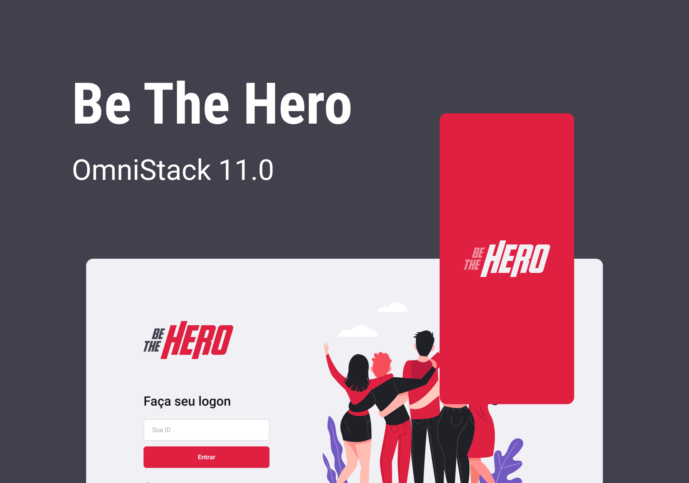

<h1 align="center">
    
</h1>

<p align="center">
  <a href="#-projeto">Projeto</a>&nbsp;&nbsp;&nbsp;|&nbsp;&nbsp;&nbsp;
  <a href="#wrench-ferramentas">Ferramentas</a>&nbsp;&nbsp;&nbsp;|&nbsp;&nbsp;&nbsp;
  <a href="#-tecnologias">Tecnologias</a>&nbsp;&nbsp;&nbsp;|&nbsp;&nbsp;&nbsp;
  <a href="#inbox_tray-como-rodar-o-projeto-na-m%C3%A1quina-local">Como rodar</a>&nbsp;&nbsp;&nbsp;|&nbsp;&nbsp;&nbsp;
  <a href="#-layout">Layout</a>&nbsp;&nbsp;&nbsp;|&nbsp;&nbsp;&nbsp;
  <a href="#memo-licença">Licença</a>
</p>

<p align="center">
  
</p>

## 💻 Projeto

O Be The Hero é um projeto que ajuda as pessoas a contribuir com ONGS de uma forma eficiente, gratuita e totalmente sem anúncios.

## :wrench: Ferramentas

As ferramentas para as configuração de ambiente são as seguintes:

- [Git](https://git-scm.com/)
- [VSCode](https://code.visualstudio.com/)

## 🚀 Tecnologias

O projeto está sendo desenvolvido com as seguintes tecnologias:

- [Node.js](https://nodejs.org/)
- [React](https://pt-br.reactjs.org/)
- [Expo](https://expo.io/)

## :inbox_tray: Como rodar o projeto na máquina local

É necessário ter o node e o yarn instalados na máquina local.

### Após a instalação, rode o comando na pasta do projeto:

```
$ npm install
```

### Acesse a aplicação

Para acessar cada parte da aplicação, leia o `README.md` de cada uma delas.

## 🔖 Layout

Você pode visualizar o layout do projeto através [desse link](<https://www.figma.com/file/2C2yvw7jsCOGmaNUDftX9n/Be-The-Hero---OmniStack-11>). Lembrando que você irá precisar ter uma conta no [Figma.](http://figma.com/)

## :memo: Licença

Esse projeto está sob a licença da Rocketseat.

---

Feito com ♥ by Rocketseat :smiley: