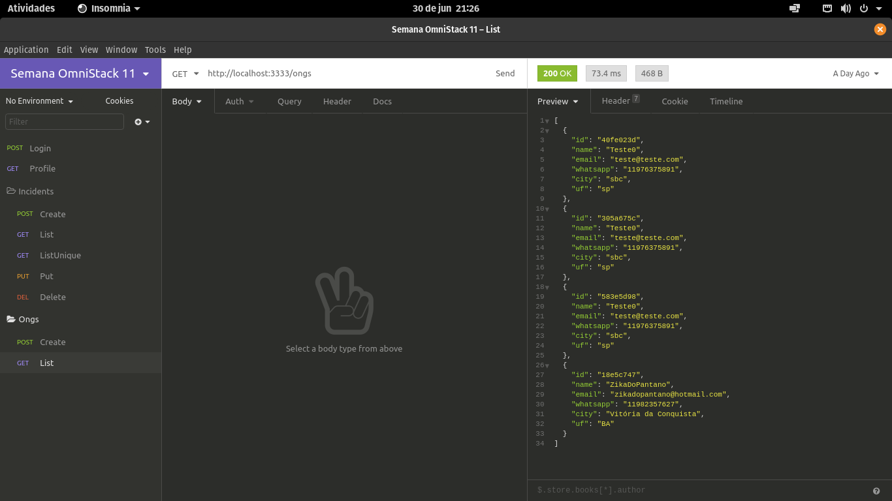

<h1 align="center">
    
</h1>

<p align="center">
  <a href="#-tecnologias">Tecnologias</a>&nbsp;&nbsp;&nbsp;|&nbsp;&nbsp;&nbsp;
  <a href="#inbox_tray-como-rodar-o-projeto-na-m%C3%A1quina-local">Projeto</a>&nbsp;&nbsp;&nbsp;|&nbsp;&nbsp;&nbsp;
  <a href="#-layout">Layout</a>&nbsp;&nbsp;&nbsp;|&nbsp;&nbsp;&nbsp;
  <a href="#memo-licença">Licença</a>
</p>

<p align="center">
  
</p>

## 🚀 Tecnologias

O projeto está sendo desenvolvido com as seguintes tecnologias:

- [Node.js](https://nodejs.org/)
- [Express](https://expressjs.com/pt-br/)
- [Nodemon](https://www.npmjs.com/package/nodemon)
- [Celebrate JS](https://github.com/arb/celebrate)
- [Jest](https://jestjs.io/)
- [Cross-env](https://www.npmjs.com/package/cross-env)
- [Supertest](https://github.com/visionmedia/supertest)
- [Knex JS](http://knexjs.org/)

## :inbox_tray: Como rodar o projeto na máquina local

É necessário ter o node instalado na máquina local.

### Após a instalação, rode o comando na pasta do projeto:

```
$ npm install
$ npm start
```

### Acesse a aplicação

Insira no seu navegador `localhost:3333` para abrir a aplicação.

## 🔖 Layout

Você pode visualizar o layout do projeto através [desse link](<https://www.figma.com/file/2C2yvw7jsCOGmaNUDftX9n/Be-The-Hero---OmniStack-11?node-id=0%3A1>). Lembrando que você irá precisar ter uma conta no [Figma.](http://figma.com/)

## :memo: Licença

Esse projeto está sob a licença da Rocketseat.

---

Feito com ♥ by Rocketseat :smiley: