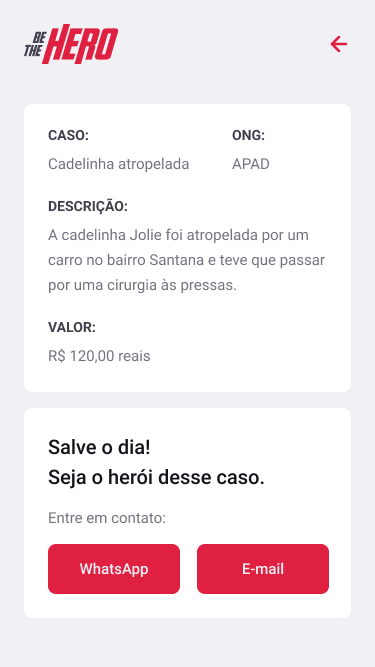

<h1 align="center">
    
</h1>

<p align="center">
  <a href="#-tecnologias">Tecnologias</a>&nbsp;&nbsp;&nbsp;|&nbsp;&nbsp;&nbsp;
  <a href="#inbox_tray-como-rodar-o-projeto-na-m%C3%A1quina-local">Projeto</a>&nbsp;&nbsp;&nbsp;|&nbsp;&nbsp;&nbsp;
  <a href="#-layout">Layout</a>&nbsp;&nbsp;&nbsp;|&nbsp;&nbsp;&nbsp;
  <a href="#memo-licença">Licença</a>
</p>

<p align="center">
  
</p>

## 🚀 Tecnologias

O app mobile está sendo desenvolvido com as seguintes tecnologias:

- [Expo](https://expo.io/)
- [React Native](https://reactnative.dev/)
- [Expo Constents](https://docs.expo.io/versions/latest/sdk/constants/)
- [Expo Mail Composer](https://docs.expo.io/versions/latest/sdk/mail-composer/)
- [Axios](https://www.npmjs.com/package/axios)
- [Intl](https://www.npmjs.com/package/intl)

## :inbox_tray: Como rodar o projeto na máquina local

É necessário ter o node e o yarn instalados na máquina local.

### Após a instalação, rode o comando na pasta do projeto:

```
$ npm install
$ yarn start
```

### Acesse a aplicação

Baixe o `APP Expo` no seu smartphone e depois scanea o QR Code que irá exibir em seu navegador.

## 🔖 Layout

Você pode visualizar o layout do projeto através [desse link](<https://www.figma.com/file/2C2yvw7jsCOGmaNUDftX9n/Be-The-Hero---OmniStack-11?node-id=37%3A95>). Lembrando que você irá precisar ter uma conta no [Figma.](http://figma.com/)

## :memo: Licença

Esse projeto está sob a licença da Rocketseat.

---

Feito com ♥ by Rocketseat :smiley: